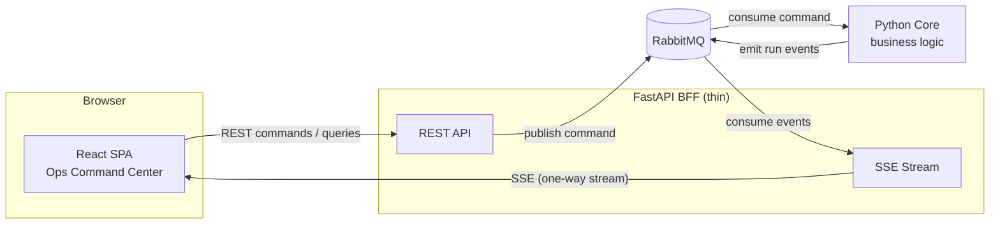
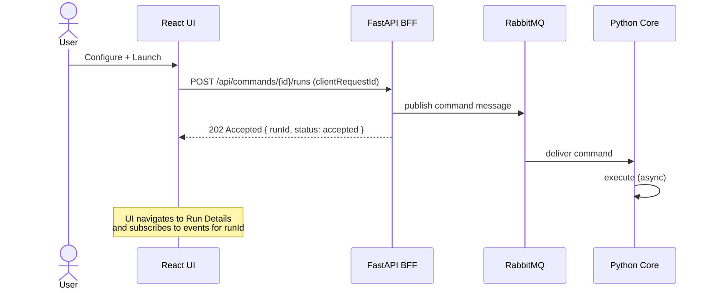
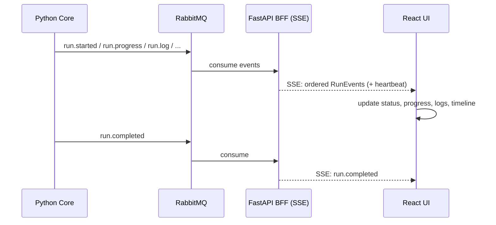
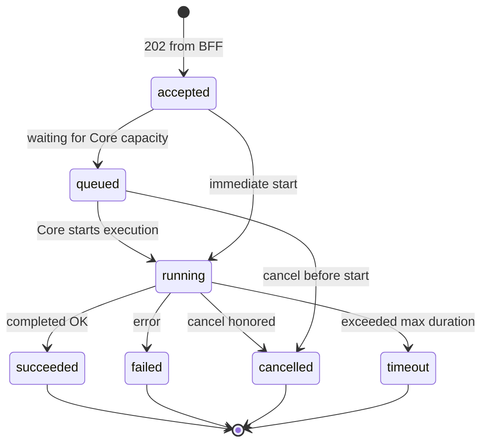

# High Level Design — Ops Command Center

> Status: Draft v1 · Audience: architects, engineering managers, future developers · Scope: sanitized, no real system names/endpoints/secrets.

## 1. Executive Summary

Ops Command Center introduces a modern web GUI for an existing internal Python Core system. The frontend is a React single-page application. A thin FastAPI Backend-For-Frontend (BFF) translates between the browser and the messaging backbone: commands travel as REST requests from the UI to the BFF and are published to RabbitMQ for the Python Core to execute; runtime updates (status, progress, logs, completion, health) flow back from the Core through RabbitMQ to the BFF, which streams them to the browser over Server-Sent Events (SSE).

The Python Core remains the single owner of business logic and is not modified. The BFF owns no business rules — it validates, translates, and streams. The frontend is UI only.

This repository contains the **frontend-only prototype**: the REST and SSE layers are mocked in-browser behind a clean service boundary so real endpoints can be substituted later without touching page components.

## 2. Goals

- Provide a modern, polished operational GUI for the existing Python Core system.
- Keep the frontend strictly UI-only; no business logic in the browser.
- Preserve the Python Core as the sole owner of business logic; minimal/no backend changes.
- Use a thin FastAPI BFF as a translation/orchestration/facade layer.
- Support asynchronous command execution (submit → ack → follow the run).
- Provide run visibility: status, progress, logs, warnings/errors, completion, and system health.
- Enable fast MVP delivery with a clean, replaceable, future-ready foundation.

## 3. Non-Goals

- No business logic in the frontend.
- No real backend, FastAPI, or RabbitMQ implementation in the prototype.
- No real authentication/authorization in the prototype (placeholder only).
- No WebSocket in v1 (deferred; see ADR-007).
- No classified or system-specific details anywhere in code, docs, or demo data.

## 4. Architecture Overview

Components:

- **React frontend** (React + TypeScript + Vite, Tailwind CSS + shadcn/ui, React Router, TanStack Query, Zustand) — renders the command center UI, submits commands, follows runs.
- **FastAPI BFF** (future) — exposes REST command/query APIs and the SSE event stream; translates HTTP ↔ AMQP.
- **RabbitMQ** (future) — integration backbone; decouples the BFF from the Core; carries command messages and run events.
- **Python Core** (existing) — executes commands, owns business truth, emits run events.

Command flow: `Browser → REST → FastAPI → RabbitMQ → Python Core`.
Event flow: `Python Core → RabbitMQ → FastAPI → SSE → Browser`.

## 5. Component Responsibilities

| Component | Responsibilities | Explicitly not responsible for |
|---|---|---|
| React frontend | Rendering, form validation UX, command submission via REST, following runs via SSE, client-side filtering/sorting of fetched data, UI state | Business rules, execution decisions, inventing state not received from the backend |
| FastAPI BFF | REST endpoints, request validation/shaping, publishing commands to RabbitMQ, consuming run events, SSE fan-out, OpenAPI contract | Business logic, long-lived business state (persistence only if explicitly required for audit/replay/history/preferences) |
| RabbitMQ | Async transport, decoupling, routing keys, retries/queues/DLQ, cross-zone flexibility | Message content semantics |
| Python Core | Business logic, command execution, run lifecycle ownership, event emission | UI concerns, HTTP concerns |

## 6. Command Flow

1. User fills a sanitized configuration form and clicks **Launch**.
2. UI sends `POST /api/commands/{commandId}/runs` with parameters and a `clientRequestId` (idempotency).
3. BFF validates the request shape, translates it to a command message, publishes to RabbitMQ.
4. BFF responds quickly with **HTTP 202 Accepted** + `runId` (the run is `accepted`/`queued`, not finished).
5. Python Core consumes the message and executes; the UI navigates to Run Details and follows the run via SSE + snapshot queries.

## 7. Event Flow

The Core emits events as execution progresses. Events reach the BFF through RabbitMQ; the BFF exposes them as a one-way SSE stream per run (or multiplexed). The UI updates status, progress, logs, and completion in real time.

## 8. Run Lifecycle

Statuses: `queued`, `accepted`, `running`, `succeeded`, `failed`, `cancelled`, `timeout`.

Transitions of note:

- `accepted` is the BFF acknowledgment; `queued` reflects broker/Core backpressure. Either may be observed first by the UI depending on event timing.
- `cancelled` is a *request*: the UI asks, the Core decides. Until a `run.cancelled` event arrives the run is still authoritative in its previous state.
- Terminal states: `succeeded`, `failed`, `cancelled`, `timeout`. No transitions out of terminal states.

## 9. State Ownership

- The frontend owns **UI state only** (sidebar, tabs, filters, preferences) — held in Zustand.
- **TanStack Query** manages all server-state-like data (command catalog, run history, run snapshots, health) with caching, refetching, and invalidation.
- SSE events update the run view; on reconnect or doubt, the snapshot API (`GET /api/runs/{runId}`) is the recovery source of truth on the client.
- The **BFF does not own business logic**. It may own persistence *only* if explicitly required for audit, replay, run history, or user preferences (see ADR-008).
- The **Python Core owns business truth**. The UI never invents state; partial data is shown as partial.

## 10. Failure Handling Summary

Full analysis in [FAILURE_MODES.md](./FAILURE_MODES.md).

| Failure | Behavior |
|---|---|
| Command submission fails | UI surfaces the error, keeps the form state, allows retry; no phantom run is shown |
| SSE disconnect | UI shows `reconnecting`/`disconnected`, retries with backoff, resyncs via snapshot |
| Duplicate events | Deduplicate by `eventId`/`sequence` |
| Out-of-order events | Order by `sequence`; snapshot recovery when gaps detected |
| Event flood | Coalescing/batching, virtualized log lists, severity filtering |
| Core unavailable | Runs stay `queued` or fail with clear status; UI shows honest state |
| RabbitMQ unavailable | BFF fails fast or degrades per production design; UI surfaces degraded health |
| BFF restart | UI reconnects SSE and refetches snapshots |

## 11. MVP Scope

- The six screens: Dashboard, Command Launcher, Run Details, Runs History, Configuration, System Health.
- Mock REST service layer implementing the [API contract](./API_CONTRACT.md) shapes (202 + runId pattern, filters, snapshots).
- Mock SSE stream implementing the [event schema](./EVENT_SCHEMA.md) (heartbeats, sequenced events, reconnect simulation).
- Strictly typed models shared across services/hooks/screens.
- Loading/empty/error states everywhere; dark enterprise mission-control styling; responsive layout.

## 12. Future Extensions

- Replace mock services with real FastAPI endpoints (same contract).
- Replace mock event stream with real `EventSource` + `Last-Event-ID` resume.
- Real RabbitMQ topology (exchanges, routing keys, DLQ) between BFF and Core.
- Authentication/authorization at the BFF; audit trail; replay buffer.
- Redis/cache only if a concrete backend need appears (SSE fan-out, rate limiting, replay buffer — see ADR-009).
- WebSocket upgrade path if true bidirectional realtime becomes a requirement (ADR-007).

## 13. Open Questions

1. Event delivery guarantees: at-least-once assumed — is exactly-once required for any consumer?
2. SSE topology: one stream per run vs. one multiplexed stream per client?
3. Replay window size and owner (BFF memory vs. persistent buffer)?
4. Run history retention: who persists history — Core, BFF, or a dedicated store?
5. Cancellation semantics in the Core: cooperative or forced? Timeout policy per command type?
6. AuthN/AuthZ model at the BFF (SSO? role → command authorization mapping?).
7. Multi-instance BFF: SSE fan-out and sticky sessions vs. shared broker subscriptions.
8. Rate limits / concurrency caps per command type.
